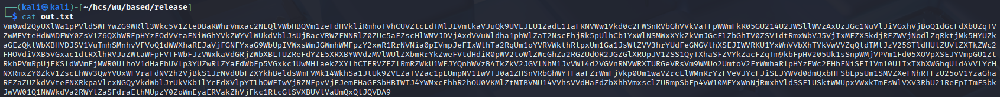
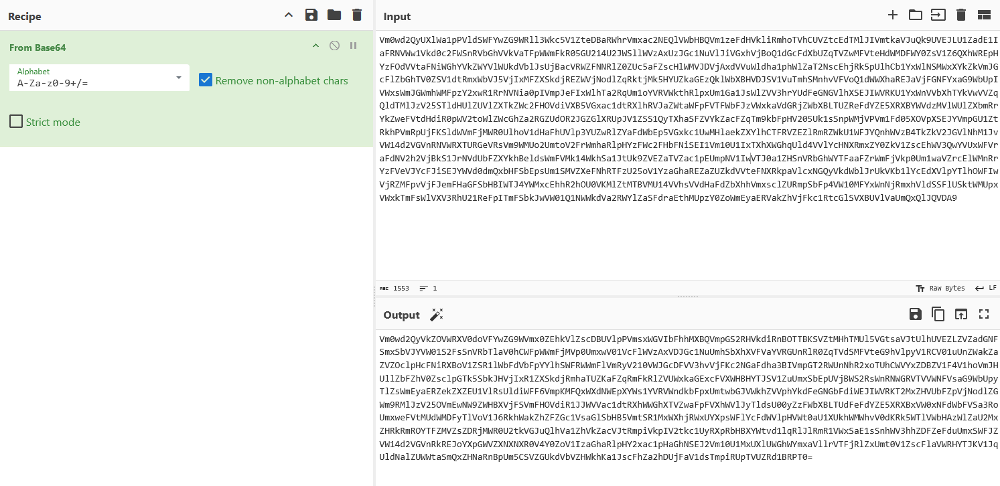
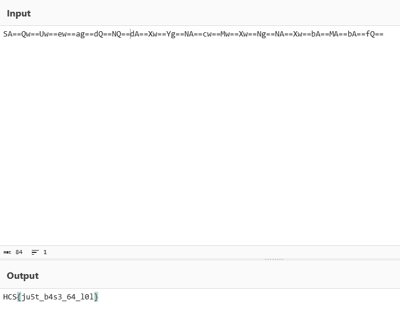

# based

The challenge first gave a zip file that contains a text file with the name of out.txt

<figure><figcaption></figcaption></figure>

Looked like basic base64 encoded string, so I went ahead and used cyberchef for this job

<figure><figcaption></figcaption></figure>

After one decoding, it still resulted in a base64 string, so I assumed that it was encoded with base64 multiple times and decoded it repeatedly until I found the flag

<figure><figcaption></figcaption></figure>

Flag: HCS{ju5t\_b4s3\_64\_l0l}
