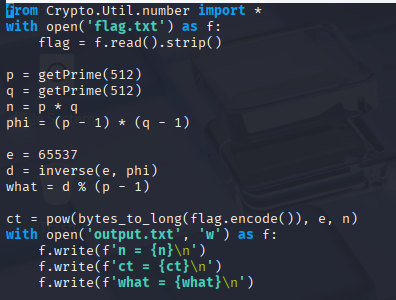

# L3AK

This challenge gave me 2 files to work with packed into a zip file. After extracting the files, I first took a look at the chall.py which contains the encryption script.

<figure><figcaption></figcaption></figure>

The 'what' variable immediately caught my attention as&#x20;
