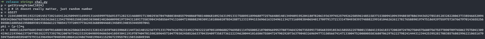
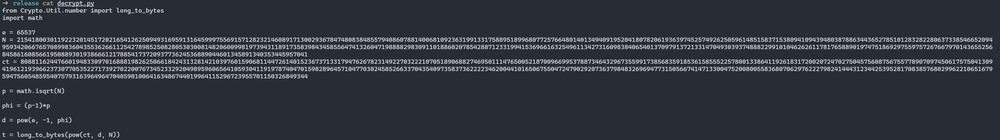

# square

The challenge gave a zip file that contained a script that showed the RSA encryption was done

<figure><figcaption></figcaption></figure>

For the solver, I used the math and pycryptodome libraries

<figure><figcaption></figcaption></figure>

since p and q were the same, and the N was already given, all I needed to do to find them is to find the square root of N\
Next, I computed the phi based on the formula given in the file\
All that's left to do was to decrypt the ciphertext

<figure><figcaption></figcaption></figure>

Flag: HCS{this\_math\_thing\_is\_confusing\_\_ayaya}
