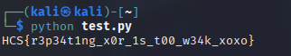

# xoxo

Given the file

```python
import os
from Crypto.Util.number import long_to_bytes
from Crypto.Util.strxor import strxor

FLAG = "HCS{placeholder}"

key = os.urandom(4) * 9

flag_bytes = FLAG.encode()

c = strxor(flag_bytes, key[:len(flag_bytes)])
print(c.hex())
# d61a7019ec6a5351aa2d120cf9065b52ec061211c12d1352c12e1056f5065b0de6365e


```

The script first takes some random 4 bytes key that's repeated 9 times. It then encodes the flag into bytes and XOR it with the key and prints the cypher text in hex.

```python
from Crypto.Util.number import long_to_bytes
from Crypto.Util.strxor import strxor


cypher = "d61a7019ec6a5351aa2d120cf9065b52ec061211c12d1352c12e1056f5065b0de6365e"

key_xor = b"HCS{"

flag_bytes = bytes.fromhex(cypher)

key = strxor(flag_bytes[:len(key_xor)], key_xor)
full_key = key * 9
flag = strxor(flag_bytes, full_key[:len(flag_bytes)])


print (flag.decode("utf-8"))
```

My solver first takes the cypher text and turns the first 4 bytes of the flag to find the key. It then extends the key length and splices it to be enough for the xor. Finally, it decodes the flag and prints it out

<figure><figcaption></figcaption></figure>

Flag: HCS{r3p34t1ng\_x0r\_1s\_t00\_w34k\_xoxo}
