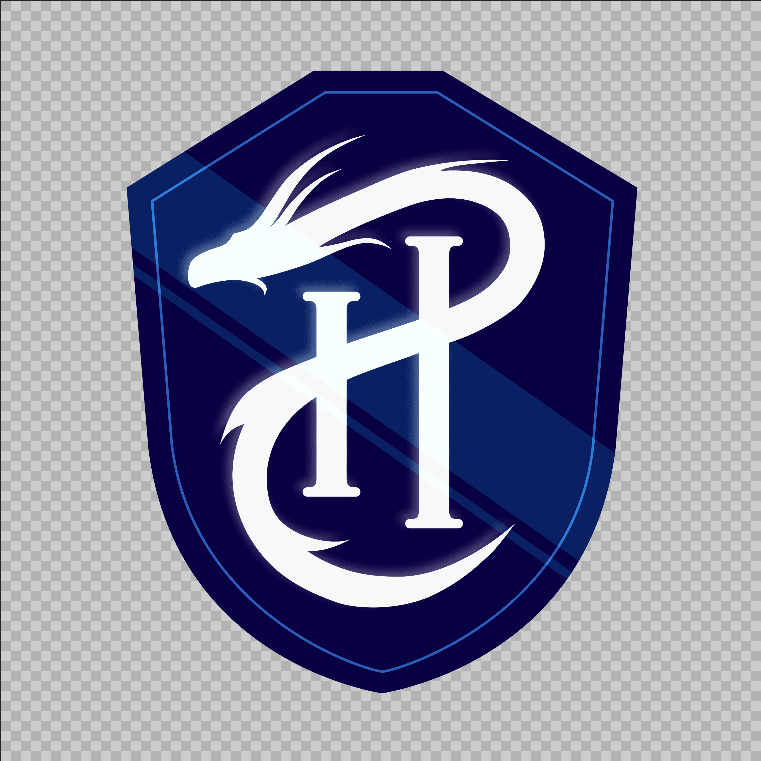
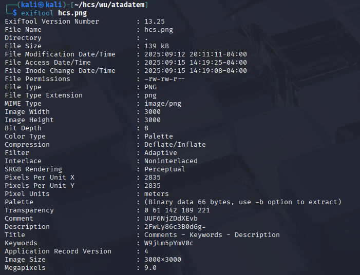
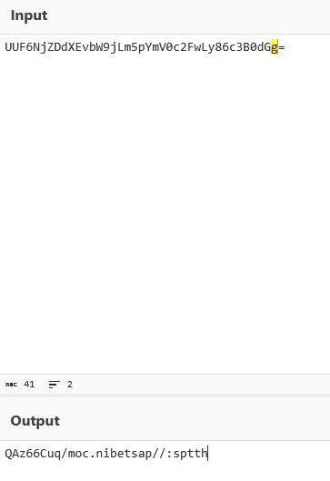
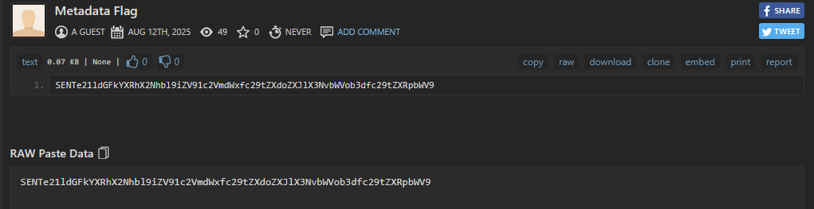
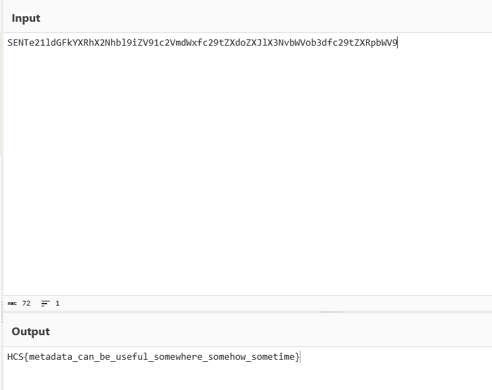

# atadatem

The challenge first gives an image file with the name hcs.png

<figure><figcaption></figcaption></figure>

Nothing special here, so I went ahead and checked the metadata with exiftool

<figure><figcaption></figcaption></figure>

first, it was the comment and description that stood out to me as it seemed like base64 encoded strings, then the title itself seemed to suggest the actual order of the base64 encoded string

<figure><figcaption></figcaption></figure>

Decoding the string gave an reversed URL, so I used ChatGPT to reverse it back and got the URL\
https://pastebin.com/quC66zAQ

<figure><figcaption></figcaption></figure>

The last string to decode

<figure><figcaption></figcaption></figure>

Flag: HCS{metadata\_can\_be\_useful\_somewhere\_somehow\_sometime}
