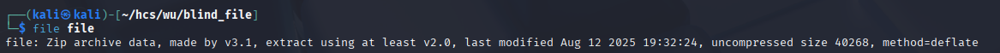
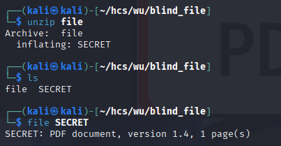
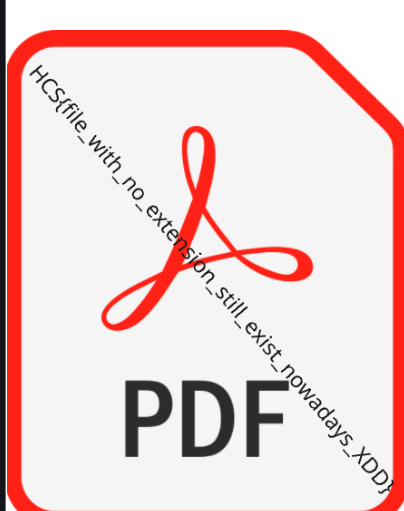

# Blind File

The challenge started with giving a file with no extension. I immediately thought of first checking the file type

<figure><figcaption></figcaption></figure>

A zip file, I proceeded to unzip it, extracting another file with no extension named secret. So, I checked the file type once more

<figure><figcaption></figcaption></figure>

Opening the 'SECRET' file revealed the flag

<figure><figcaption></figcaption></figure>

Flag: HCS{file\_with\_no\_extension\_still\_exist\_nowadays\_XDD}
