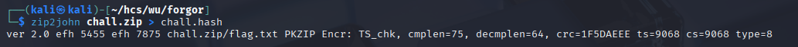
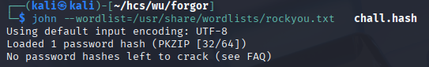
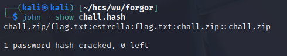
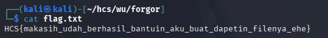

# I Forgot Something

Since the challenge only gave a zip file with no clues of the password, I tried using jacktheripper with rockyou wordlist

<figure><figcaption></figcaption></figure>

First, I extracted the hash from the zip.

<figure><figcaption></figcaption></figure>

I then cracked the hash to find the password

<figure><figcaption></figcaption></figure>

Revealing the password, estrella, which I used to unzip the file

<figure><figcaption></figcaption></figure>

Flag: HCS{makasih\_udah\_berhasil\_bantuin\_aku\_buat\_dapetin\_filenya\_ehe}
