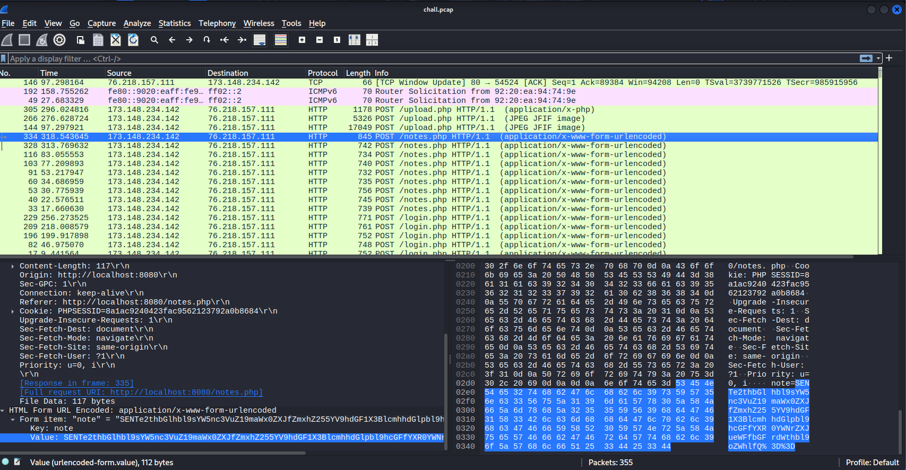
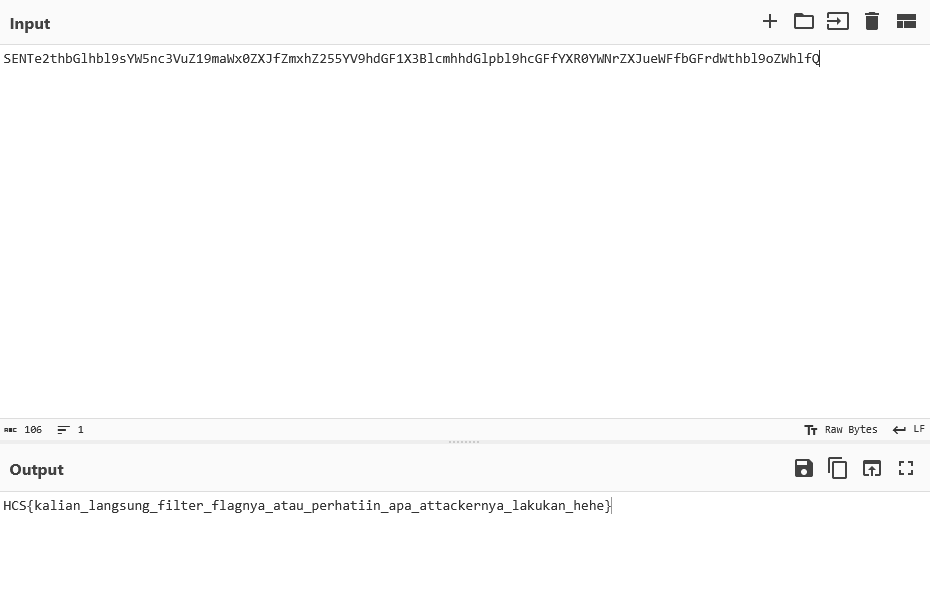

# My Networ(th)k

From the pcap file the challenge gave, I immediately tried sorting it by info and quickly found some base64 string within a packet.

<figure><figcaption></figcaption></figure>

I then decoded it using cyberchef which resulted in the flag.

<figure><figcaption></figcaption></figure>

Flag: HCS{kalian\_langsung\_filter\_flagnya\_atau\_perhatiin\_apa\_attackernya\_lakukan\_hehe}
