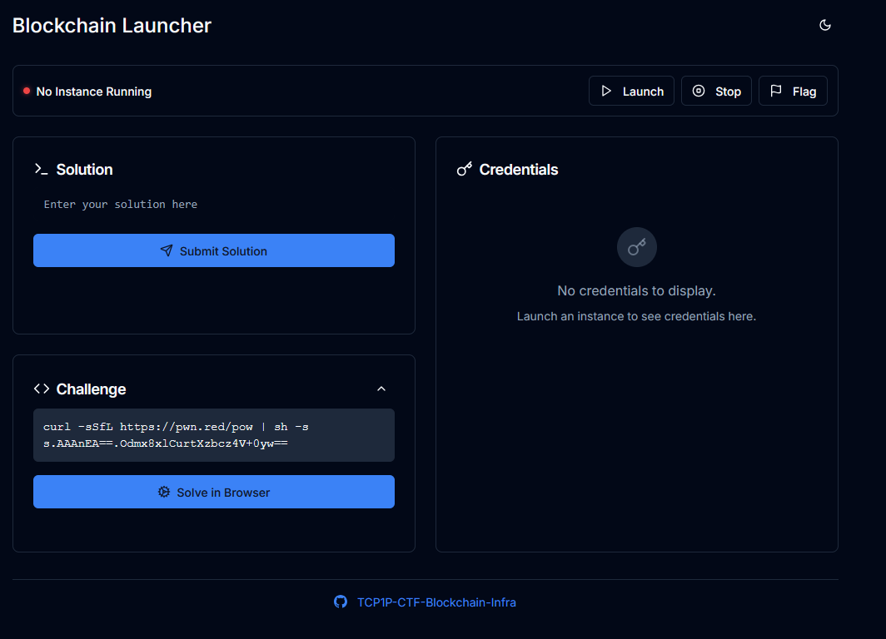
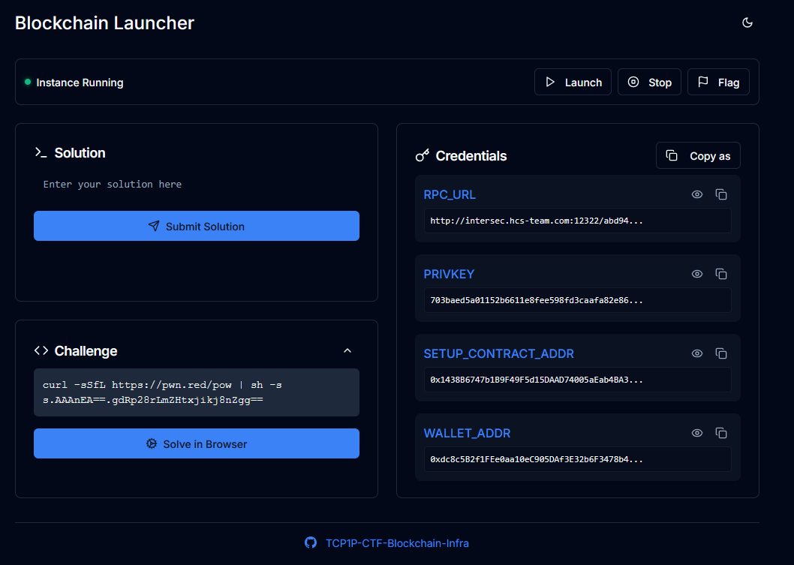

# toggle

The challenge gave a .sol file and a link

<figure><figcaption></figcaption></figure>

after submitting the proof of work and starting the instance, I got the credentials I needed to solve it

<figure><figcaption></figcaption></figure>

using the credentials, I used this solver to find the solution

```python
from web3 import Web3
from eth_account import Account

RPC_URL = "http://intersec.hcs-team.com:12322/abd94e7a-3932-4c78-aa2e-e48e9fb8ac25"
PRIVKEY = "703baed5a01152b6611e8fee598fd3caafa82e86a41445baa233ccd805265554"
SETUP_CONTRACT_ADDR = "0x1438B6747b1B9F49F5d15DAAD74005aEab4BA34c"

# Minimal ABI for the Setup contract you showed in a previous task:
# function solve() external;
# function isSolved() external view returns (bool);
SETUP_ABI = [
    {"inputs":[],"name":"solve","outputs":[],"stateMutability":"nonpayable","type":"function"},
    {"inputs":[],"name":"isSolved","outputs":[{"internalType":"bool","name":"","type":"bool"}],"stateMutability":"view","type":"function"},
]

def main():
    w3 = Web3(Web3.HTTPProvider(RPC_URL, request_kwargs={"timeout": 30}))
    assert w3.is_connected(), "Cannot connect to RPC"

    acct = Account.from_key(PRIVKEY)
    print(f"Using wallet: {acct.address}")
    print(f"Chain ID: {w3.eth.chain_id}")

    setup = w3.eth.contract(address=Web3.to_checksum_address(SETUP_CONTRACT_ADDR), abi=SETUP_ABI)

    # Check status before
    before = setup.functions.isSolved().call()
    print(f"isSolved (before): {before}")

    # Build a type-2 (EIP-1559) transaction. If the chain rejects 1559, use the legacy block below.
    nonce = w3.eth.get_transaction_count(acct.address)
    base_fee = w3.eth.get_block("latest")["baseFeePerGas"]
    # Safe defaults; bump if you get "underpriced"
    max_priority = w3.to_wei(2, "gwei")
    max_fee = base_fee + w3.to_wei(20, "gwei")

    tx = setup.functions.solve().build_transaction({
        "from": acct.address,
        "nonce": nonce,
        "chainId": w3.eth.chain_id,
        "maxPriorityFeePerGas": max_priority,
        "maxFeePerGas": max_fee,
        # Gas limit estimate + buffer
        "gas": int(setup.functions.solve().estimate_gas({"from": acct.address}) * 1.2),
        # value: 0 by default
    })

    signed = acct.sign_transaction(tx)
    tx_hash = w3.eth.send_raw_transaction(signed.raw_transaction)  # v6: raw_transaction
    print(f"Sent solve() tx: {tx_hash.hex()}")

    receipt = w3.eth.wait_for_transaction_receipt(tx_hash, timeout=120)
    print(f"Tx mined in block {receipt.blockNumber} status={receipt.status}")

    after = setup.functions.isSolved().call()
    print(f"isSolved (after): {after}")

if __name__ == "__main__":
    main()

```

The solver works by connecting to the RPC node given by the challenge. It then loaded the contract using the given SETUP\_CONTRACT\_ADDR with minimal ABI only containing solve() and issolved(). Afterwards, it unlocked the wallet with the private key. Then, it checked the initial state by calling issolved() which should return false. Next, it built and sent a transaction that calls solve(). After waiting for the transaction confirmation, it would call issolved() again which would now return true.

<figure><figcaption></figcaption></figure>

Flag: HCS{minat\_belajar\_blockchain?\_hubungi\_mas\_hanz}
