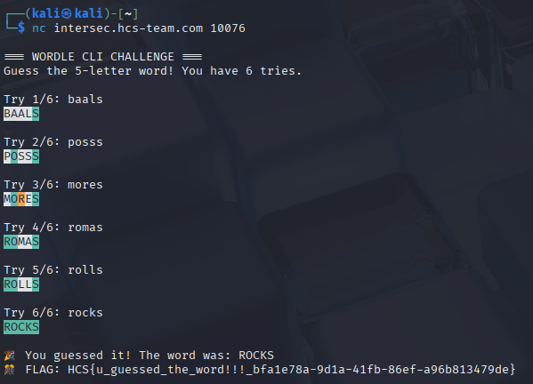

# Wordle

This one's a simple challenge, after starting the instance, I used nc to connect to the host and port then guessed the right letters for the word as per usual wordle games

<figure><figcaption></figcaption></figure>

Flag: HCS{u\_guessed\_the\_word!!!\_bfa1e78a-9d1a-41fb-86ef-a96b813479de}
