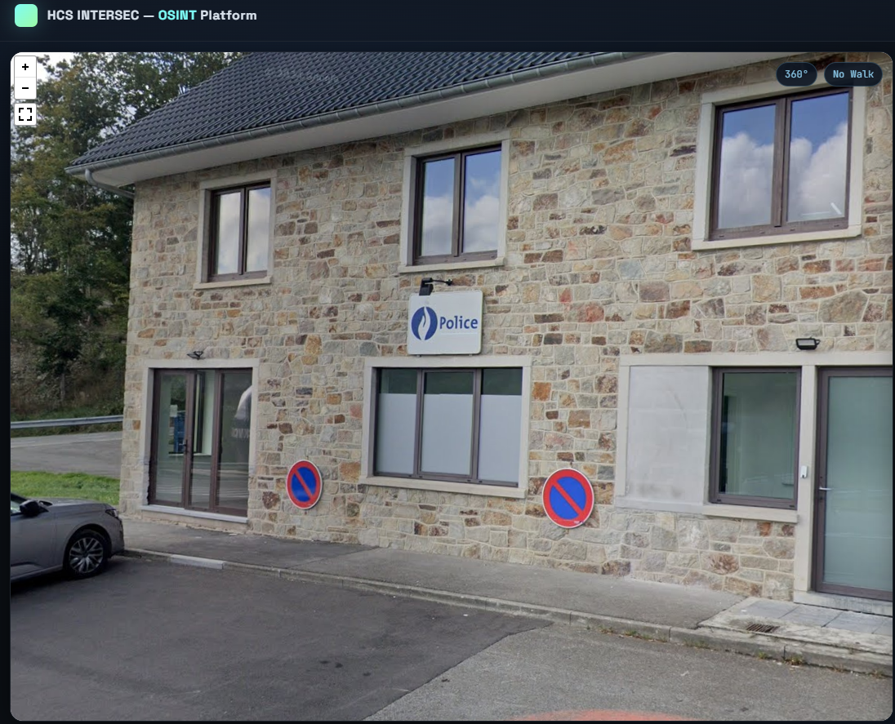
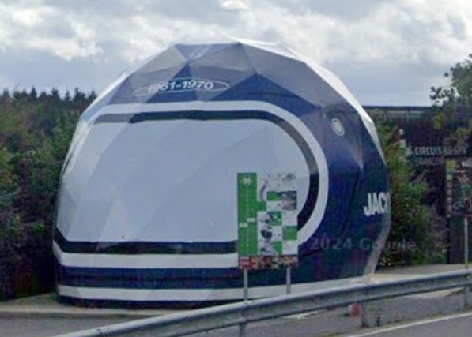
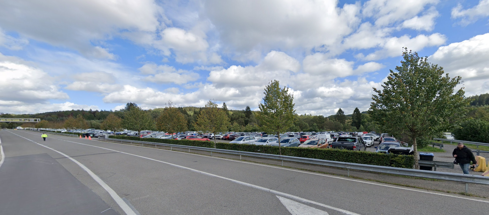
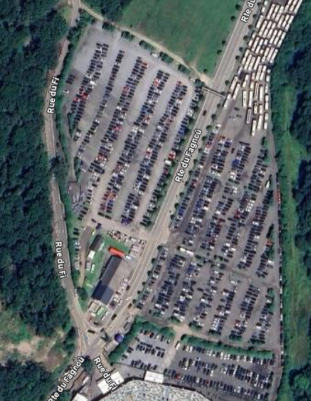
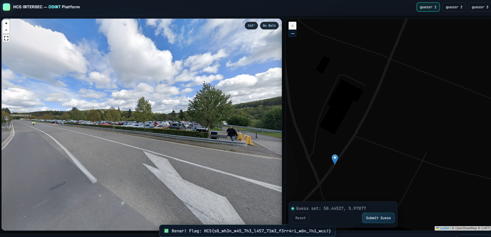

# guessr 1

The first thing I noticed from the challenge is the police department sign

<figure><figcaption></figcaption></figure>

using google lens, I was able to find out that it's the police logo in Belgium.

<figure><figcaption></figcaption></figure>

Using google lens again, I found out that it's a helmet replica in Circuit de Spa - Francorchamps.

<figure><figcaption></figcaption></figure>

At first, I thought of looking up for police stations around the area of the circuit, but considering the large parking lot in the vicinity, I chose to just use google maps' satelite view to find the large helmet replica and the parking lot

<figure><figcaption></figcaption></figure>

Eventually I found it East of the circuit with the helmet replica situated near the entrance to the circuit.

<figure><figcaption></figcaption></figure>

Flag: HCS{s0\_wh3n\_w45\_7h3\_l457\_71m3\_f3rr4r1\_w0n\_7h3\_wcc?}
