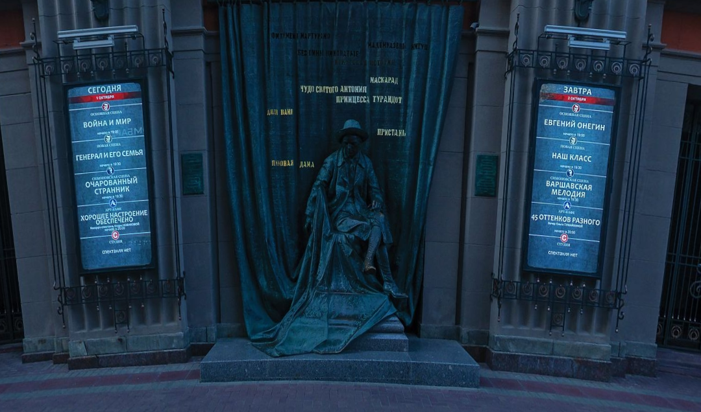
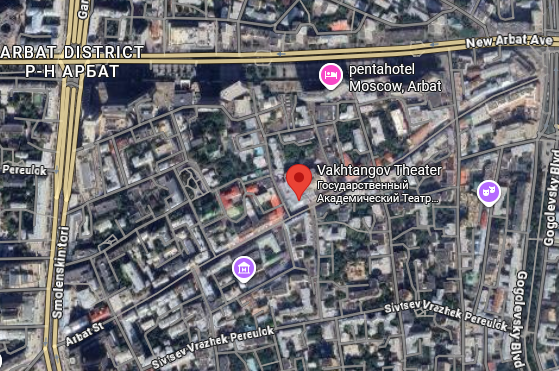
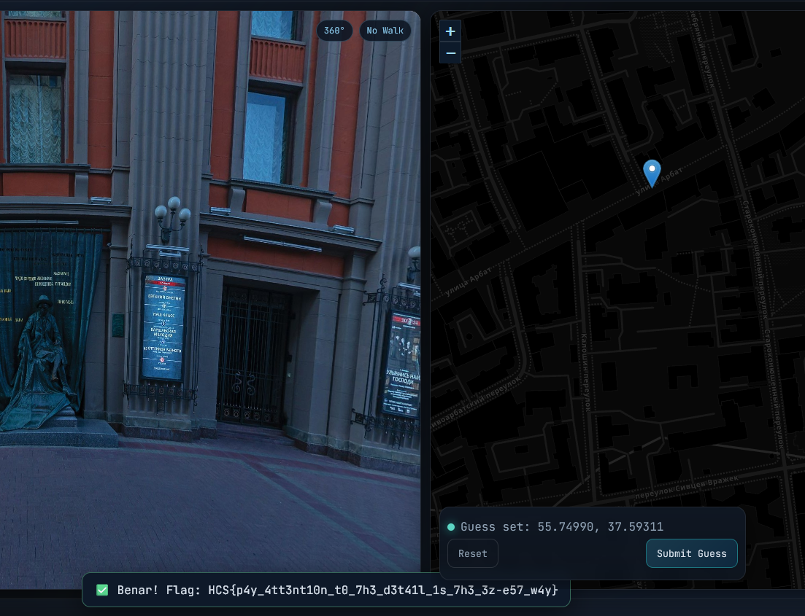

# guessr 2

Immediately, the Cryrillic alphabet caught my eyes and suspected Russia, although other Slavic Nations aren't off the guess either.

<figure><figcaption></figcaption></figure>

By using google lens, I found out that it's a statute of Yevgeny Vakhtangov, situated at the Vakhtangov Theater on Arbat Street, Moscow, Russia.

<figure><figcaption></figcaption></figure>

All that's left to do was to get the flag.

<figure><figcaption></figcaption></figure>

Flag: HCS{p4y\_4tt3nt10n\_t0\_7h3\_d3t41l\_1s\_7h3\_3z-e57\_w4y}
