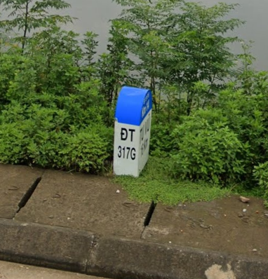
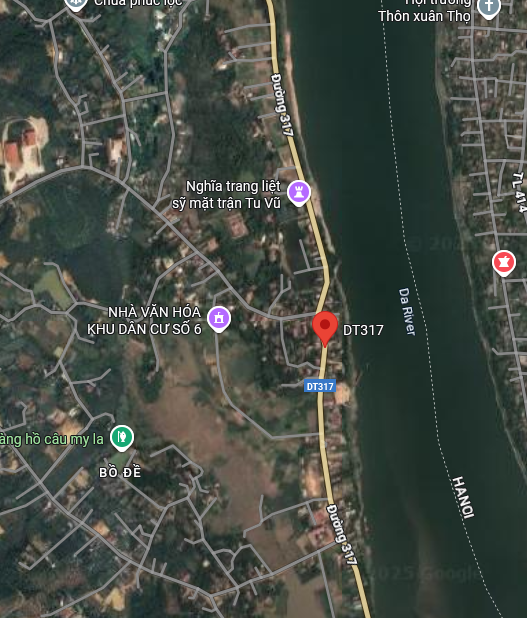
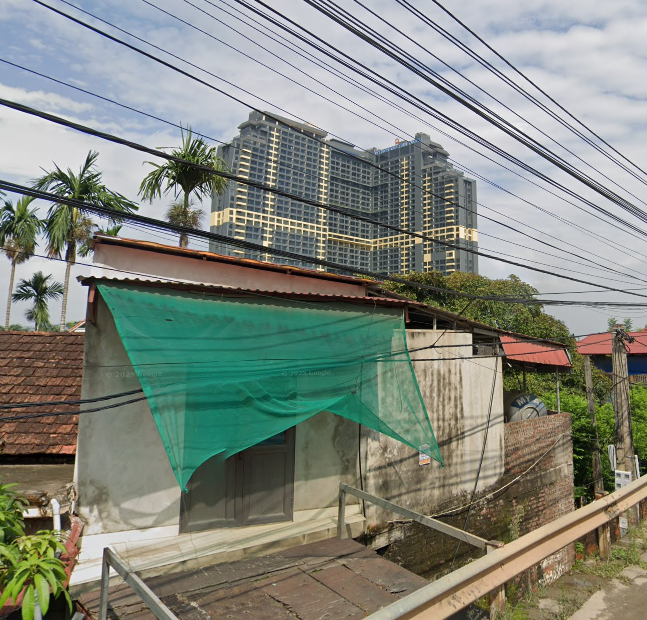
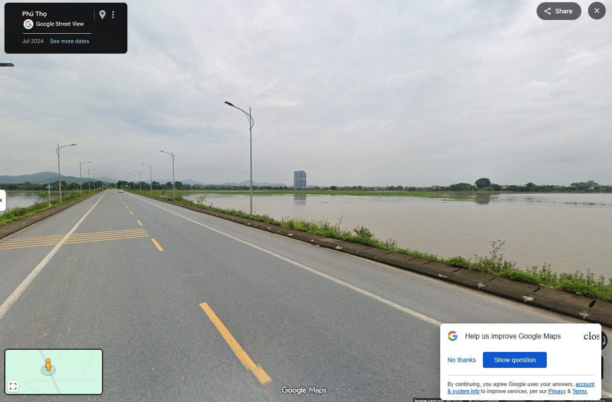

# guessr 3

I thought of Southeast Asia immediately, and looking at the writing I found, I suspected Vietnam.

<figure><figcaption></figcaption></figure>

Searching up DT 317G didn't seem to get me close to anywhere like the picture, so I thought that since the letter G may be an indication of it being a branch of the main road, I tried searching up DT 317G

<figure><figcaption></figcaption></figure>

I continued with trying to find any other clues by going through the entire DT 317 road on street view, which bore no result until I saw something of resemblance from the guessr picture.

<figure><figcaption></figcaption></figure>

The tall hotel's yellow color on the middle was what made me think of it as the same building on the guessr.

<figure><figcaption></figcaption></figure>

After finding the road, I just needed to find the exact spot where the picture was taken

